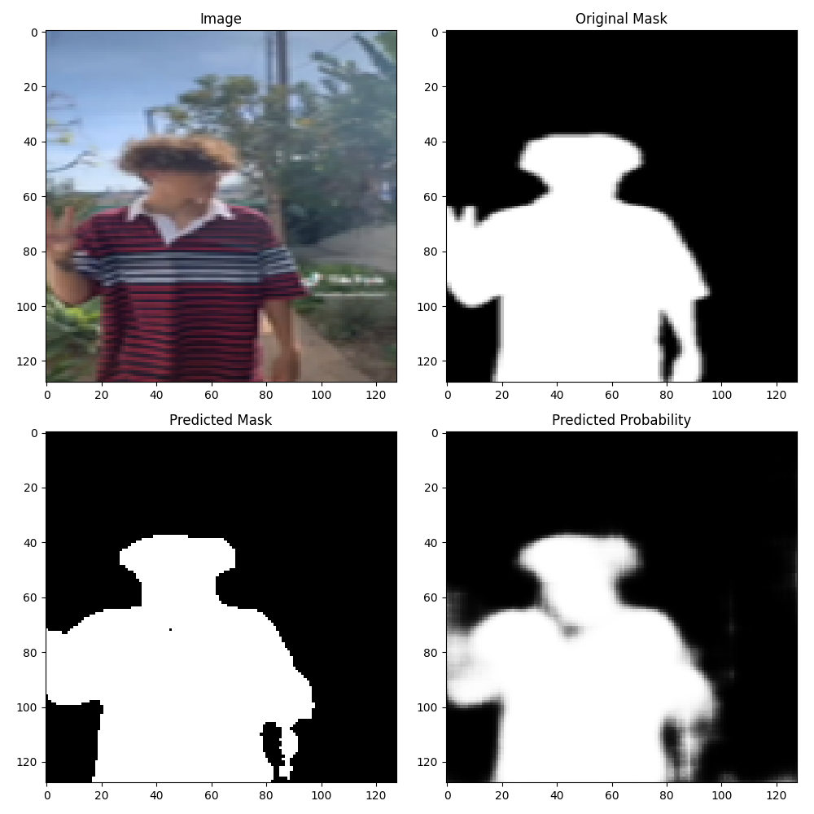
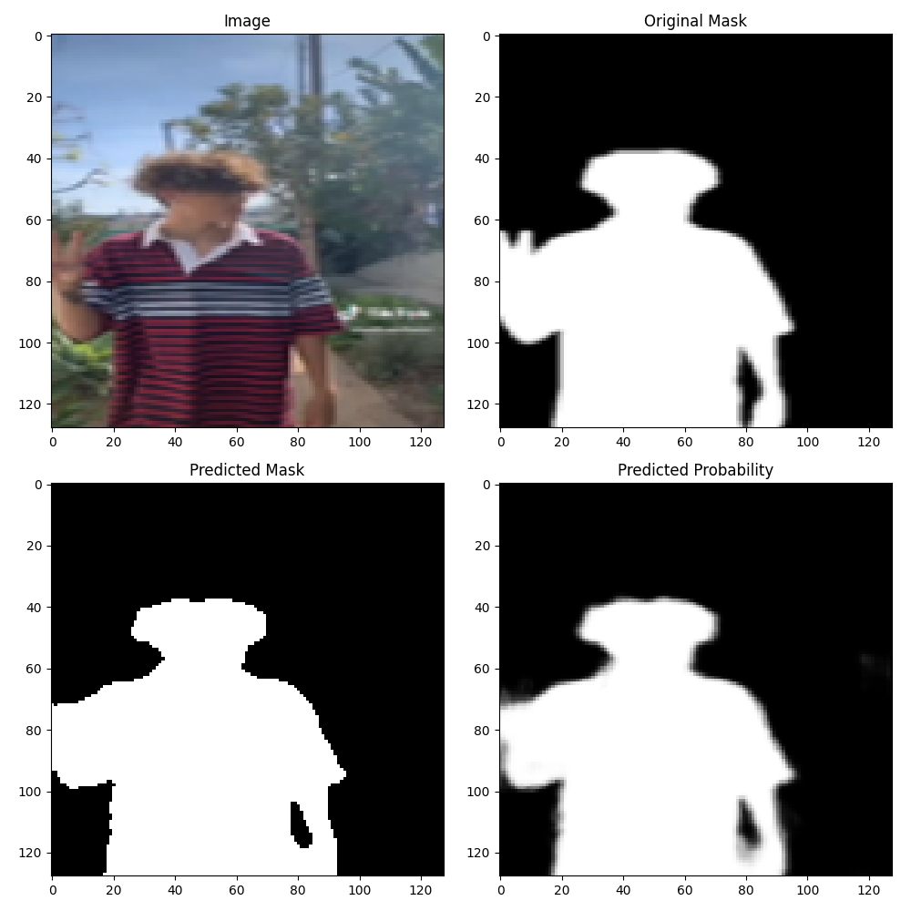
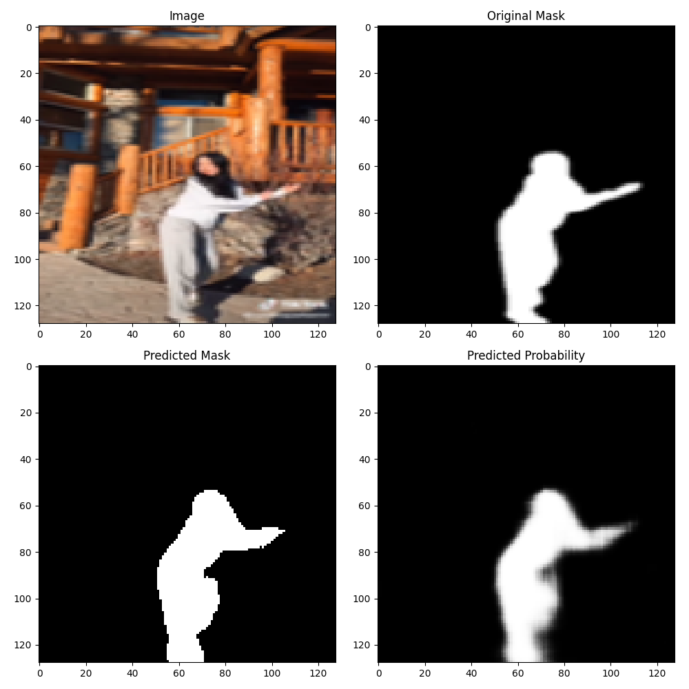
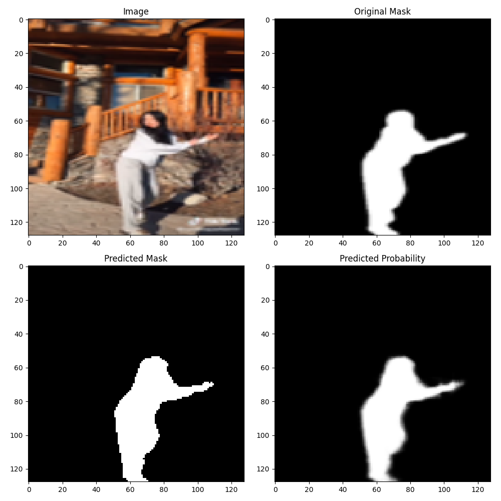
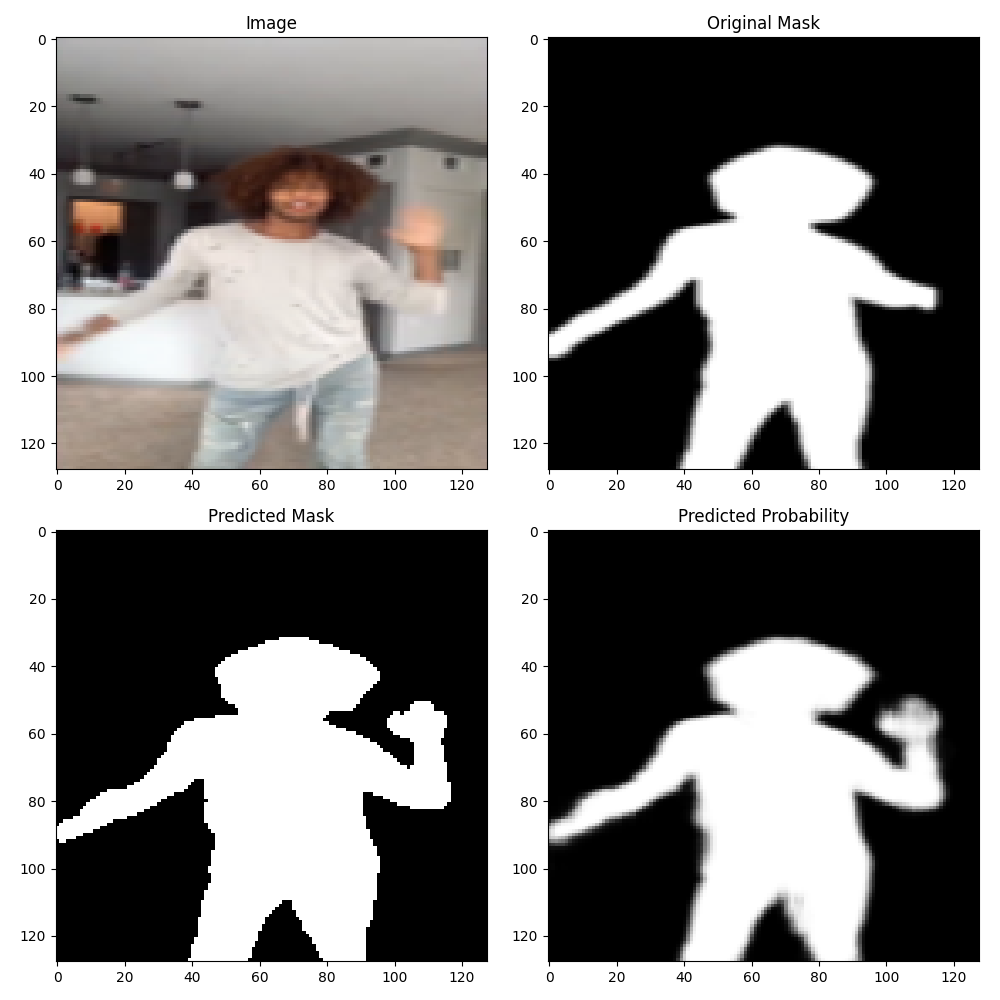

# Binary semantic segmentation

This project implements an end-to-end image segmentation pipeline. The goal is to train and evaluate two different architectures: a `Hourglass` and a `UNet`. Moreover, the `UNet` architecture is trained on two differents hidden_dims in order to increase model expressivity. 
The project is modular and designed to be easily extensible to new datasets, models and training configurations.

---
## Results

The results are displayed as a plot with four panels. In the top-left is the dataset image, top-right shows the ground-truth masked image, bottom-left shows the model-predicted mask using a pixel-wise threshold of 0.5 and bottom-right shows the model’s full mask without any threshold applied.
Here is showed the comparison between the `Hourglass` and the `Unet` model with the `--big` flag.  

<p align="center">
  
  
</p>
<p align="center">
  
  
</p>

What can be observed is that the U-Net model with larger hidden dimensions is able to better predict the semantic mask. Additionally, the masked image with threshold closely resembles the unthresholded masked image, indicating that the model is much more confident in its predictions.

This demonstrates the effectiveness of skip connections in accurately capturing and understanding the scene.


Furthermore, the model’s effectiveness is also evident when the ground-truth mask of an image is incorrect. Despite this, the model is able to predict a mask that is much more sensible than the one provided in the dataset.

<p align="center">
  
</p>

This means that not only is the model able to obtain the correct mask of the subject, but when faced with an incorrect mask, it can recover the human body geometry to overcome this limitation.

---

---

## Project Structure

```
├── dataset
│   ├── images
│   └── masks
├── model
│   └── hourglass.py
|    └── unet.py
├── output
│   ├── checkpoints
│   │   ├── big_unet
│   │   │   └── model_graph
│   │   ├── hourglass
│   │   │   └── model_graph
│   │   └── unet
│   │       └── model_graph
│   └── figures
│       ├── big_unet
│       ├── hourglass
│       └── unet
└── utils
│    └── dataloader.py
│    └── dataset.py
│    └── plot.py
│    └── printer.py
│    └── show_results.py
└── README.md
└── main.py
└── test.py
└── train.py
```

## How to run
You can run (train or test) two possible architectures (`Hourglass` or `Unet`).
```bash
git clone git@github.com:claudiocamolese/Binary-semantic-segmentation.git
cd Binary semantic segmentation
```
Then, to train use the `--train` flag and for testing and producing outputs use `--test` flag.
To use `Hourglass` architecture use `--hourglass` flag.
To use `Unet` architecture use `--unet` flag. Here you can add the `--big` flag use the `Unet` model with higher hidden dims.

Example:
```bash
python main.py --train --unet --big
python main.py --train --unet
python main.py --train --hourglass
```
```bash
python main.py --test --unet --big
python main.py --test --unet
python main.py --test --hourglass
```


